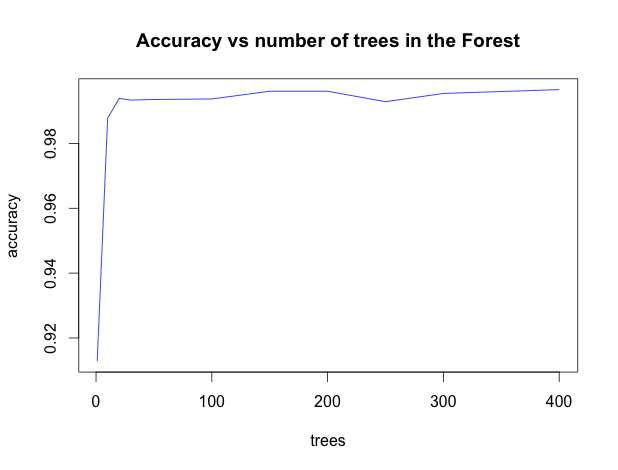

Workout Classification
========================================================

## Overview
The objective of this project is to differentiate between various wrong ways (and one correct way) of performing a workout involving dumpbells. The data set consists of various measurments obtained by wearable hardware.

## Cleaning and preprocessing data

There are originally 160 predictors and no codebook. A cursory glance at the data after reveals that:

* Some of the predictors do not seem to be related to measurments.
* When reading the file as CSV some values are missinterpreted as factors instead of numbers.
* A lot of the values contain NA.

Before doing any kind of prediction, we start by aleviating some of the problems.
We load the training set in this manner in order to fill in NA values instead of blank strings:


```r
training = read.csv("pml-training.csv",stringsAsFactors=F,na.strings=c("NA",""))
```

The next step is to remove any "predictors" that are not related to measurments. 
In my estimation, these are the first 7 fields:

* "X" - This is just a sample index             
* "user_name" - This identify the person performing the exercise.          
* "raw_timestamp_part_1" - timestamp
* "raw_timestamp_part_2" - timestamp
* "cvtd_timestamp" - timestamp      
* "new_window"  - no idea            
* "num_window" - no idea

The following function rids us of these fields

```r
removeUseless <- function(dataSet) {
  #variables that do not correspond to measurments
  useless = c(1,2,3,4,5,6,7)
  dataSet = dataSet[,-useless]
  return(dataSet)
}
```

Whereas it is possible for some learning algorithms to function with NAs in data, most of them require clean data.
We have no insight into why some data is missing in the set or how to impute it, so it is best to try solving the problem for the subset of the data without NAs. To accomplish this we first convert everything to numeric:


```r
#Coerse all columns to numeric. Note that anything that cannot be coersed will be turned into NA
makeNumeric <- function(dataSet) {
    return (data.frame(apply(dataSet, 2, as.numeric)))
}
```

And then eliminate any columns that contain NA values:


```r
removeNA <- function(dataSet) {
  cols = sapply(dataSet, function(x) { any(is.na(x)) })
  return (dataSet[,!cols])
}
```

Note that the last two steps drop the "classe" column, so we need to add it back to the dataset before training.
The result is a dataset of 53 variables with no NA values. Although it is possible to reduce the dimensionality further in several ways, this seems like a reasonable enough number of predictors.

## Training

Random Forests are widely successful as "black box" classifiers, so we can try one and see where it leads us. 
It quickly becomes apparent that using the **train** method of the caret package requires significant patience. On the other hand, using the **randomForest** package directly produces results quite quickly, even with all the predictors, all the rows, and many trees.

The following method creates test and training sets, trains a random forest, and the computes the accuracy on the test set.


```r
trainAndTest <- function(cleanData, trees) {
  inTrain = createDataPartition(cleanData$classe, p = .7)[[1]]
  trainSet = cleanData[ inTrain,]
  testSet = cleanData[-inTrain,]
  model = randomForest(classe~.,data=trainSet,ntree=trees)
  prediction <- predict(model, testSet)
  return (postResample(prediction, testSet$classe))
}
```

The function trains very fast, so it allows us the luxury to experiment with the number of trees.
The following plot illustrates that once you go over 100 trees, accuracy stays pretty much constant.



# Out of Sample Error Estimate

http://www.stat.berkeley.edu/~breiman/RandomForests/cc_home.htm

The out-of-bag (oob) error estimate

In random forests, there is no need for cross-validation or a separate test set to get an unbiased estimate of the test set error. It is estimated internally, during the run, as follows:

Each tree is constructed using a different bootstrap sample from the original data. About one-third of the cases are left out of the bootstrap sample and not used in the construction of the kth tree.

Put each case left out in the construction of the kth tree down the kth tree to get a classification. In this way, a test set classification is obtained for each case in about one-third of the trees. At the end of the run, take j to be the class that got most of the votes every time case n was oob. The proportion of times that j is not equal to the true class of n averaged over all cases is the oob error estimate. This has proven to be unbiased in many tests. 

## Conclusion

## R code


